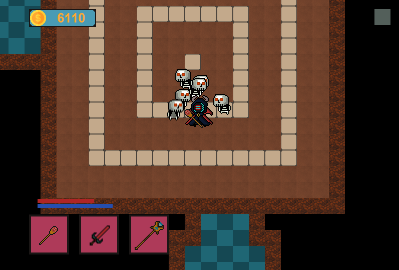
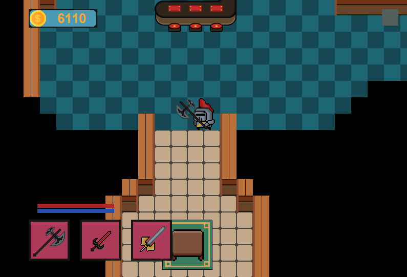

# HellWorld
<a href="https://github.com/salo368/HellWorld/blob/main/README_Spa.md">(Versión español)</a>

Mini game made with a 2D proto-graphic engine in Java

The HellWorld project is a mini game developed in Java that features 2D graphics elements. From its inception, it was created completely from scratch, making it a 2D graphic protomotor. This game offers a unique, challenging, and visually exciting playable experience.

## Features

- **2D Game Engine**: The game utilizes a custom 2D game engine developed from scratch, allowing for graphics and textures rendering on the screen.
- **Coordinates and Collisions**: The game uses a coordinate system to position and move objects on the screen. Additionally, collision detection is implemented to handle interactions between game elements.
- **Animations**: Animations system are included to make the game more dynamic and visually appealing.
- **Controls**: The player can control the main character using keyboard controls.
- **Screens and Menus**: The game includes a start screen, game screens, and possibly other menus or result screens depending on your implementation.

## Visuals

Here are some visuals that illustrate the game in action:

## System Requirements

- Java (version 1.8.0_241)

## How to Use

1. Clone this repository: `git clone https://github.com/salo368/HellWorld.git`
2. Open the project in your preferred Java development environment.
3. Run the main class of the game, which contains the `main` method.
4. A game window will open with the start screen.
5. Use the keyboard controls to move the main character around the game world, avoiding enemies.
6. Enjoy the game and have fun!

---

Thank you for your interest in the HellWorld project! If you have any questions or need further information, feel free to contact me.
