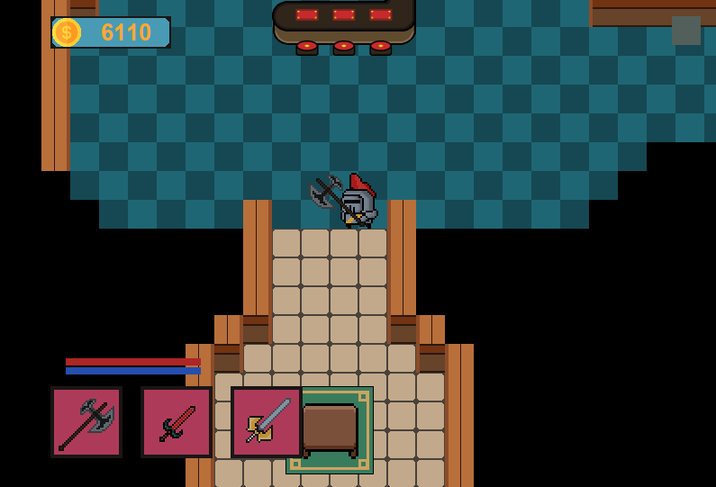

# HellWorld

Mini juego creado con un proto-motor gráfico en 2D con Java

El proyecto HellWorld es un mini juego desarrollado en Java que presenta elementos gráficos en 2D. Desde su inicio, se creó completamente desde cero, convirtiéndolo en un proto-motor gráfico en 2D. Este juego ofrece una experiencia de juego única, desafiante y visualmente emocionante.

## Características

- **Motor de Juego en 2D**: El juego utiliza un motor de juego personalizado en 2D desarrollado desde cero, lo que permite renderizar gráficos y texturas en la pantalla.
- **Coordenadas y Colisiones**: El juego utiliza un sistema de coordenadas para posicionar y mover objetos en la pantalla. Además, se implementa la detección de colisiones para manejar las interacciones entre los elementos del juego.
- **Animaciones**: Se incluye un sistema de animaciones para hacer que el juego sea más dinámico y visualmente atractivo.
- **Controles**: El jugador puede controlar el personaje principal utilizando controles de teclado.
- **Pantallas y Menús**: El juego incluye una pantalla de inicio, pantallas de juego y posiblemente otros menús o pantallas de resultado dependiendo de tu implementación.

## Visuales

Aquí tienes algunas imágenes que ilustran el juego en acción:

## Requisitos del Sistema

- Java (versión 1.8.0_241)

## Cómo Utilizarlo

1. Clona este repositorio: `git clone https://github.com/salo368/HellWorld.git`
2. Abre el proyecto en tu entorno de desarrollo de Java preferido.
3. Ejecuta la clase principal del juego, que contiene el método `main`.
4. Se abrirá una ventana de juego con la pantalla de inicio.
5. Utiliza los controles del teclado para mover al personaje principal por el mundo del juego, evitando a los enemigos.
6. ¡Disfruta del juego y diviértete!

---

¡Gracias por tu interés en el proyecto HellWorld! Si tienes alguna pregunta o necesitas más información, no dudes en contactarme.
